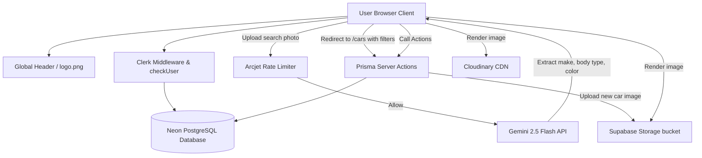

# DriveIQ - Technical & Functionality Documentation

DriveIQ is a modern, premium, India-focused used-car marketplace built as a high-performance web application. It features Clerk authentication, a Neon PostgreSQL database with Prisma ORM, Google Gemini AI integrations, and Arcjet security layers, all bound together by a sleek Apple-like design system.

---

## 🛠 Technology Stack

### Core Framework & UI
*   **Next.js 15.4.6 (App Router)**: Hybrid Server Components (RSC) and Client Components with Turbopack for lightning-fast hot reloading.
*   **React 19.1.0**: Incorporates new React features and optimized server/client rendering hooks.
*   **Tailwind CSS v4**: Utilized for utility styling, offering ultra-fast builds and clean CSS management.
*   **Motion (Framer Motion)**: Powers fluid animations, transitions, and hover states.
*   **OGL (WebGL Library)**: Creates a stunning, interactive 3D WebGL physics-based particles backdrop in the hero section.
*   **Lucide React**: Vector icons utilized throughout the interface.

### Backend & API
*   **Next.js Server Actions**: Zero API endpoint overhead; all actions are performed securely through Server Actions located under `actions/`.
*   **Prisma ORM 6.14.0**: Type-safe query builder, configured with a singleton client (`lib/prisma.js`) exporting custom outputs to avoid database connection exhaustion.
*   **Neon Serverless PostgreSQL**: Relational database storage with pooled connection settings for serverless functions and direct connections for migrations.

### Identity & Security
*   **Clerk Auth (`@clerk/nextjs` v6)**: Complete authentication platform. Users are automatically synced to the PostgreSQL database upon logging in through custom middleware (`lib/checkUser.js`).
*   **Arcjet Security**: Integrates IP-level rate-limiting on the AI-powered search (configured at 10 requests per hour per IP) to prevent system abuse.

### AI & Media Pipelines
*   **Google Gemini 2.5 Flash API**: Integrated via `@google/generative-ai` for two main image parsing tasks:
    1.  *AI Search (User-facing)*: Identifies the make, body type, and color of a car from an uploaded photo.
    2.  *AI Prefill (Admin-facing)*: Fully parses a car image to extract specifications (make, model, year, transmission, fuel, color, engine specs, estimated price, description) and pre-fill the creation form.
*   **Supabase Storage**: Backend storage for user-uploaded car images.
*   **Cloudinary CDN**: Image remote pattern configured to display pre-seeded or existing remote car images safely.

---

## 🏗 System Architecture

The following diagram illustrates how user interactions, middleware, database operations, and external services interact:



---

## 🎨 Premium Design System

DriveIQ uses a modern, high-contrast, minimalist design language inspired by premium tech landing pages.

*   **Primary CTA Color**: `#0071E3` (Apple Blue)
*   **Hover CTA Color**: `#005BB5` (Deep Blue)
*   **Background Color**: `#FFFFFF` (Pure White)
*   **Text Color**: `#1D1D1F` (Charcoal Black)
*   **Brand Logo**: Pitch Black (`#000000` text with `/logo.png`)
*   **Animations**: Smooth micro-interactions on buttons, scale effects on cards, and clean slide-overs for dialogue forms.

---

## 📂 Project Directory Structure

```
├── actions/                  # Next.js Server Actions (all DB logic lives here)
│   ├── admin.js              # Admin authorization & metric queries
│   ├── car-listing.js        # Listing queries & search filtering
│   ├── cars.js               # Car CRUD & Gemini AI form pre-fill
│   ├── home.js               # Homepage featured cars & Gemini AI image search
│   ├── settings.js           # Fetching & saving dealership settings
│   └── test-drive.js         # Scheduling & status management for bookings
├── app/                      # Next.js App Router Routes
│   ├── (admin)/admin/        # Protected admin panels
│   ├── (auth)/               # Clerk sign-in / sign-up custom pages
│   ├── (main)/               # Protected user routes
│   │   ├── cars/             # Car detail pages & filters
│   │   ├── test-drive/       # Test-drive booking workflow
│   │   ├── reservations/     # User reservation panel
│   │   └── saved-cars/       # User wishlist panel
│   └── layout.js             # Root layout with Header overlap protection (pt-20)
├── components/               # Reusable UI component catalog
│   ├── ui/                   # Shadcn primitives (Dialog, Select, Input, Calendar...)
│   └── Header.jsx            # Premium sticky global navigation
├── hooks/                    # Reusable Client hooks (use-fetch API wrapper)
├── lib/                      # Helper scripts, clients & constants
│   ├── arcjet.js             # Arcjet rate-limiter config
│   ├── checkUser.js          # Clerk-to-DB database sync utility
│   ├── data.js               # Static filter arrays (Makes, Body Types, FAQs)
│   ├── helpers.js            # Serializers (Decimal values) & currency formatters (INR)
│   ├── prisma.js             # Prisma DB client singleton
│   └── supabase.js           # Supabase client singleton for file storage
└── prisma/                   # Database migrations & schemas
    ├── schema.prisma         # Single Prisma data model declarations
    └── migrations/           # Generated SQL migrations
```

---

## 💾 Database Schema

The database consists of 6 core relational models defined in `prisma/schema.prisma`:

### `User`
Tracks users authenticated via Clerk.
*   `id`: UUID (Primary Key)
*   `clerkUserId`: String (Unique index mapping to Clerk)
*   `email`: String (Unique)
*   `name`: String (Optional)
*   `imageUrl` / `phone`: String (Optional)
*   `role`: Enum (`USER` | `ADMIN` - defaults to `USER`)

### `Car`
Stores listings of cars for sale.
*   `id`: UUID (Primary Key)
*   `make` / `model` / `color` / `fuelType` / `transmission` / `bodyType`: String
*   `year` / `mileage` / `bhp` / `seats`: Integer
*   `price`: Decimal (Mapped to SQL `Decimal(10, 2)` for precision)
*   `description`: String
*   `status`: Enum (`AVAILABLE` | `UNAVAILABLE` | `SOLD`)
*   `featured`: Boolean (Defaults to false)
*   `images`: String[] (Array of hosted image URLs)

### `DealershipInfo`
Primary contact and location information.
*   `id`: UUID (Primary Key)
*   `name`: String
*   `address`: String
*   `phone`: String
*   `email`: String

### `WorkingHour`
Showroom hours for test drives, mapped to a specific `DealershipInfo`.
*   `id`: UUID (Primary Key)
*   `dayOfWeek`: Enum (`MONDAY` ... `SUNDAY`)
*   `openTime` / `closeTime`: String (e.g., `"09:00"`)
*   `isOpen`: Boolean (Showroom availability flag)

### `UserSavedCar` (Wishlist Join Table)
Connects `User` to their bookmarked `Car` listings.
*   `id`: UUID (Primary Key)
*   `userId` / `carId`: Foreign keys (Composite unique index)

### `TestDriveBooking`
Details scheduled showroom visits for test drives.
*   `id`: UUID (Primary Key)
*   `carId` / `userId`: Foreign keys
*   `bookingDate`: Date
*   `startTime` / `endTime`: String
*   `status`: Enum (`PENDING` | `CONFIRMED` | `COMPLETED` | `CANCELLED` | `NO_SHOW`)
*   `notes`: String (Optional)

---

## 🌟 Core Features & Functionality

### 1. AI-Powered Visual Search
*   **How it works**: Users can take or upload a photo of any car on the homepage. The system base64-encodes the image and submits it to **Gemini 2.5 Flash**.
*   **Result**: Gemini analyzes the car's physical visual attributes and returns a structured JSON payload containing the detected `make`, `bodyType`, and `color`.
*   **Handling**: The user is redirected to the `/cars` browse catalog pre-filtered by these exact properties.
*   **Security**: Rate-limited using **Arcjet** (up to 10 image parses per hour per IP) to guard against high API consumption costs.

### 2. Used-Car Browse & Filter Catalog (`/cars`)
*   **Filters**: Real-time filtering by price sliders, mileage, make, body style, fuel type, transmission, color, and seating capacity.
*   **Serialization**: Car listings feature `Decimal` price values which are converted into safe floats via `serializeCarData` before crossing the React Server-to-Client threshold.
*   **EMI Calculator**: An in-modal calculator on each car detail card allowing users to calculate monthly interest and loan payments based on customizable deposit values.

### 3. Dynamic Test-Drive Scheduler (`/test-drive/[id]`)
*   **Interactive Booking**: Users select a date from an inline calendar.
*   **Dynamic Slots**: The system queries `DealershipInfo` and its associated `WorkingHour` schedule. It disables days when the showroom is closed and dynamically maps available hourly time slots based on the showroom's opening/closing hours.
*   **Conflicts**: Slots already booked by other users for the selected car are automatically hidden.
*   **Notification**: Triggers a clean confirmation modal stating that the booking has been registered and is pending approval.

### 4. Custom Indian Dealership Hub
*   **Physical Presence**: The details page renders a dedicated premium dealership location card.
*   **Location**: Hardcoded to a premium corporate address:
    *   **Name**: `DriveIQ Motors India`
    *   **Address**: `Level 5, Orion Business Tower, Plot 27, Velocity Avenue, Bandra Kurla Complex (BKC), Mumbai, Maharashtra 400051, India`
    *   **Contact**: `+91 98123 45678` | `contact@driveiq.in`

### 5. Protected Admin Dashboard (`/admin`)
*   **Authorized Role Access**: Pages starting with `/admin` check that the logged-in Clerk user exists in the local database with `role === "ADMIN"`.
*   **Listing Controls**: Admin can add new listings, edit car parameters, and toggle availability status (`AVAILABLE`, `UNAVAILABLE`, `SOLD`).
*   **AI Form Autocomplete**: When listing a new car, admins can upload a car photo. **Gemini 2.5 Flash** parses the image and outputs a complete details payload to prefill the listing form automatically.
*   **Multi-Image Uploads**: Integrated with a file drag-and-drop area. The images are automatically streamed to a Supabase bucket, and the secure URLs are stored in the database.
*   **Booking Management**: Admins have a grid dashboard listing all test drive appointments. They can approve bookings to change status to `CONFIRMED` or mark them `COMPLETED`, `CANCELLED`, or `NO_SHOW`.
*   **Settings Form**: Allows admins to modify the showroom's weekly working hours schedule and manage user roles (promoting or demoting other users to/from admin status).
